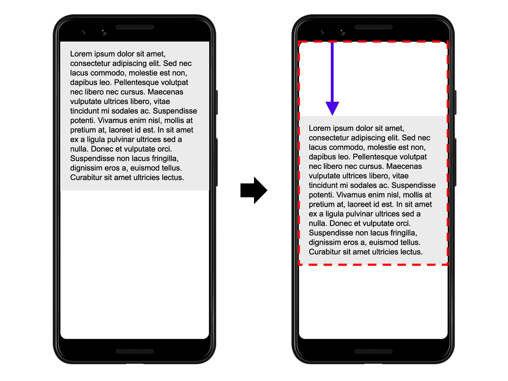

# Core metrics

Web vitals are collected from 75% of page views.

## Main metrics

| Name                      | Description                                    | Good  | Requires improvement |
| ------------------------- | ---------------------------------------------- | ----- | -------------------- |
| Cumulative layout shift   | Render time of largest element in the viewport |       | 2.5-4s               |
| Largest contentful paint  |                                                | <0.2s | 0.2-0.4s             |
| Interaction to next paint | Latency of user interactions                   | <2.5s | 2.5-4s               |

### LCP (Largest contentful paint)

Definition of LCP element:

- ``.
- `<image>` in svg.
- `<video>` - time of preview load or the first frame.
- element with `background-image`.
- element with text.

Size of element is defined based on size of element visible in viewport and doesn't take into account margins, paddings or borders.
Until web fonts aren't loaded LCP isn't reported.
LCP stopped to be reported when user starts interaction (tap/scroll/click).

## Performance observer

```js
performance.mark('login-started');
// ...
performance.mark('login-finished');

performance.measure('login-duration', 'login-started', 'login-finished');

function performanceObserver(list, observer) {
  list.getEntries().forEach((entry) => {
    if (entry.entryType === 'mark') {
      console.log(`${entry.name}'s startTime: ${entry.startTime}`);
    }

    if (entry.entryType === 'measure') {
      console.log(`${entry.name}'s duration: ${entry.duration}`);
    }
  });
}

const observer = new PerformanceObserver(performanceObserver);

observer.observe({ entryTypes: ['measure', 'mark'] });
```

## INP (Interaction to next paint)

Calculated for the longest duration of event handlers - **from time the user begins the interaction to the moment the browser is next able to paint a frame**.

- Click, keyboard and tap events are recorded
- Scroll or hover events are not recorded.

## Cumulative layout shift

layout shift score = impact fraction \* distance fraction

The impact fraction measures how unstable elements impact the viewport area between two frames.
The distance fraction is the greatest horizontal or vertical distance any unstable element has moved in the frame divided by the viewport's largest dimension.


